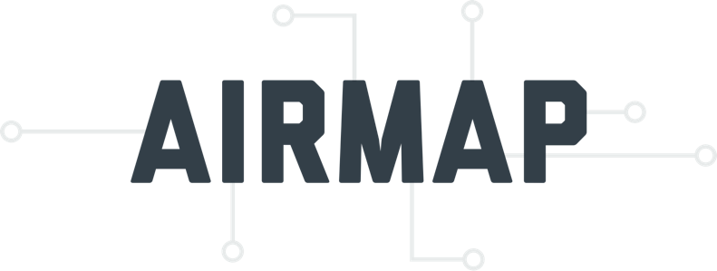

# GeofencingSDK-Swift

## What Is This?

The AirMap Geofencing SDK enables your application to receive real-time alerts as your aircraft approaches, enters or intersects any airspace during its flight. You simply provide the service an airspace source (the AirMap map tile service, the AirMap Airspace Api, or your own custom GeoJSON formatted geometries), the aircraft position and velocity, and we will provide you with real-time geofence notification updates.

## Integration

#### CocoaPods

Requires CocoaPods 1.5.3+

The Geofencing SDK is a CocoaPod written in Swift. CocoaPods is a dependency manager for Cocoa projects. If you don't have CocoaPods, You can install it with the following command:

`$ sudo gem install cocoapods`

To integrate the Geofencing SDK into your Xcode project, navigate to the directory that contains your project and create a new **Podfile** with `pod init` or open an existing one, then add 
`pod 'AirMapGeofencingSDK', :git => 'https://github.com/airmap/GeofencingSDK-Swift-Example'` to the main target. Make sure to add the line `use_frameworks!`.

```ruby
target 'MyApp' do
  use_frameworks!
  pod 'AirMapGeofencingSDK', :git => 'https://github.com/airmap/GeofencingSDK-Swift-Example'
end
```

Then, run the following command to install the dependencies:

`$ pod install`

### Importing

```swift
import AirMapGeofencing
```

When parsing or using any of the of the geometry features (`PolygonFeature, MultiPolygonFeature, etc`) you must also import `Turf`

```swift
import Turf
```

## Running the Geofencing Service
Use the Airspace Source from the example app `AirspaceMapSource` to provide geometries to geofence your flight to. You can also create your own source as long as it conforms to the AirspaceSource protocol.

~~~swift
let mapView = AirMapMapView(frame: frame)
let source = AirspaceMapSource(mapView)
~~~

Construct the GeofencingService with the airspace source and set its `GeofencingStatusDelegate` to receive status updates.

~~~swift
let geofencingService = GeofencingService(source: source)
geofencingService.delegate = self

func onStatusChanged(statuses: [GeofencingStatus]) {
  /*
    *  Each airspace will have a respective status returned by the Geofencing Service
    *
    *  The status will include the level such as SAFE, APPROACHING, ENTERING, INTERSECTING, etc
    *  If the aircraft is entering or approaching airspace, the status will include the proximity
    *  The distanceTo and timeTo are calculated based on the aircraft's telemetry and the airspace's geometry 
  */
}
~~~

Provide telemetry updates of the aircraft to the Geofencing Service by calling onPositionChanged & onSpeedChanged, which can be made independent of each other. The more frequent these methods are called, the more accurate the geofencing alerts will be. We suggest calling them 5-10 times a second if possible.

The GeofencingSDK uses the N-E-D (North-East-Down) coordinate system, i.e. a positive velocityX means movement towards the north, negative velocityX meaning movement towards the south. Make sure you telemetry updates adhere to this.

~~~swift
  let altitudeAgl: Meters = 100
  let coordinate = CLLocationCoordinate2D(latitude: 0, longitude: 0)
  geofencingService.onPositionChanged(coordinate: coordinate, altitudeAgl: altitudeAgl)

  let velocity = (x: 10, y: 10, z: 0)
  geofencingService.onSpeedChange(velocity: velocity)
~~~

## GeofencingStatus

Each time the Geofencing Service runs, it will return a list of statuses. One for each respective airspace returned by the AirspaceSource. The GeofencingStatus levels are as follows:

        SAFE,           // The aircraft is not approaching, entering or intersecting the airspace 
        APPROACHING,    // The aircraft is approaching (within 30 seconds of intersecting) the airspace 
        ENTERING,       // The aircraft is entering (within 10 seconds of intersecting) the airspace
        INTERSECTING,   // The aircraft is intersecting the airspace
        UNAVAILABLE     // The Geofencing service was unable to calculate a status due to lack of information (missing aircraft's telemetry or airspace info)
        
If the status level is approaching or entering, the status will include proximity data. The proximity data includes a timeTo (seconds) & distanceTo (meters), which indicates when the aircraft will intersect the airspace given its current course and speed. 

## Running the SDK Sample App

* Clone this repo

* Download your application's `airmap.config.json` file from the AirMap Developer Portal and set the Mapbox access token.

* Add the config file to the root of the project

* `pod install`

* Run sample app

## API Keys

An API Key can be obtained from our [Developer Portal](https://dashboard.airmap.io/developer).

## Terms of Service

By using this SDK, you are agreeing to the [AirMap Developer Terms & Conditions](https://www.airmap.com/developer-terms-service/)

## License

The Geofencing SDK is linked with unmodified libraries of <a href=https://github.com/mapbox/turf-swift/>Turf Swift</a> licensed under the <a href=https://github.com/mapbox/turf-swift/blob/master/LICENSE.md>ISC license</a>. As well as <a href=https://github.com/ReactiveX/RxSwift>RxSwift</a> licensed under the <a href=https://github.com/ReactiveX/RxSwift/blob/master/LICENSE.md>MIT License.</a>

## Troubleshooting

If you deleted the AirMapGeofencingSDK pod and are trying to reinstall it but the framework is not appearing you may need to delete your AirMapGeofencingSDK CocoaPods cache.

`pod cache clean 'AirMapGeofencingSDK' --all`

If you are installing from a local reference to the podspec you must have the vendored framework downloaded and unzipped to the corresponding path used in `s.ios.vendored_frameworks`.

## Support

You can get support from AirMap with the following methods:

- Join our developer workspace on [**Slack**](https://join.slack.com/t/airmap-developers/shared_invite/enQtNTA4MzU0MTM2MjI0LWYwYTM5MjUxNWNhZTQwYmYxODJmMjFiODAyNzZlZTRkOTY2MjUwMzQ1NThlZjczY2FjMDQ2YzgxZDcxNTY2ZGQ)
- https://developers.airmap.com/
